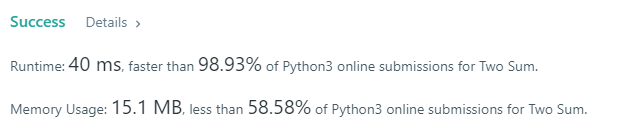
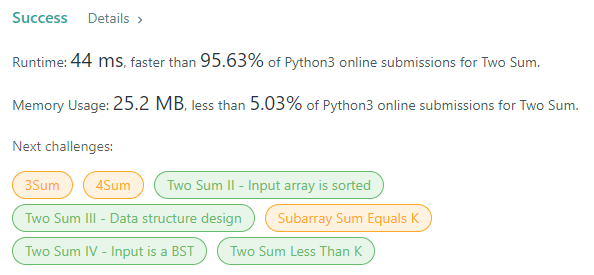

# Overview 

Solutions in Python 

# Sol1 

The [Sol1](sol1.py) implements what explained in general terms in the [README](../readme.md)

As expected it is quite fast 

# Sol2 

The [Sol2](sol2.py) implements the same as the above but using recursion instead of for loop 

Apparently it is a bit slower and consumes much more memory 

